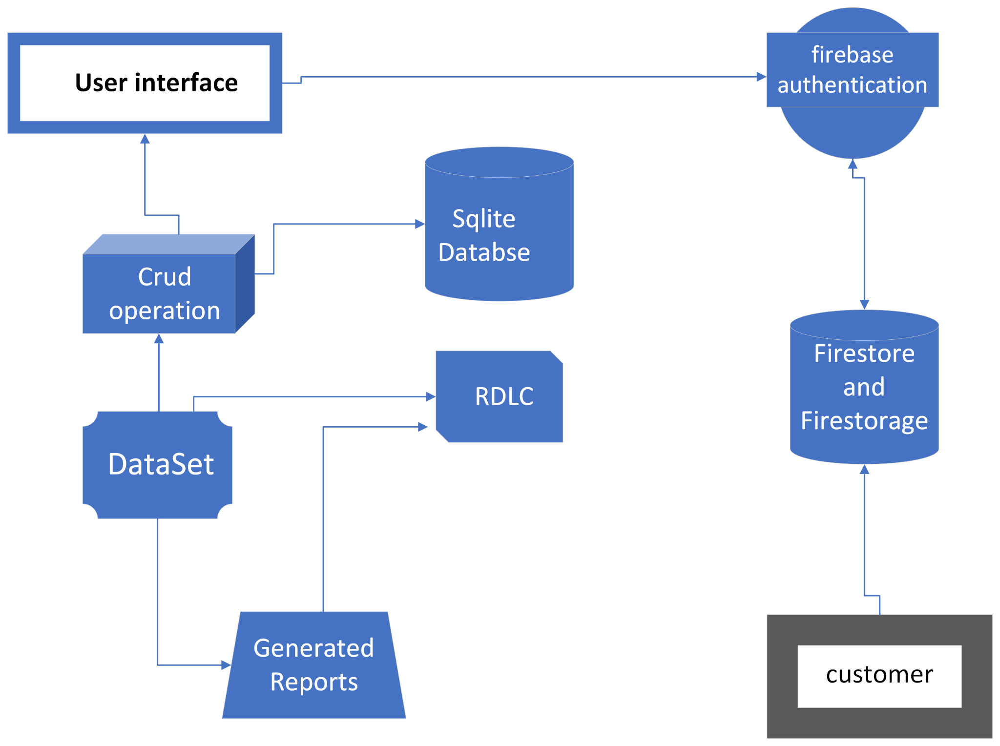

# ReportGenerator-DesktopApp

This is a desktop application for generating, storing, and managing customer service reports.  
Built using WPF (.NET), SQLite, and integrates with Firebase for authentication and cloud storage.

---

## Features

- Export reports using RDLC reporting
- Login & role based 
- Generate & store reports locally
- Sync with Firestore & Firestorage
- CRUD on users & reports

---

## Tech stack
- WPF (.NET 8)
- SQLite
- Firebase Auth & Firestore
- RDLC reports
---

### 

 

---